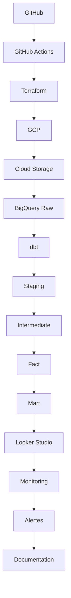

# Enterprise Analytics Engineering Challenge

Build in Public: Modern Data Stack on GCP + dbt

## Contexte

Projet de plateforme Analytics d entreprise en cours de construction, de l ingestion brute aux dashboards, avec les standards d une stack de production : architecture, tests, documentation, CI/CD.

## Scenario

Je pars d un simple fichier CSV et je construis une plateforme data digne d une startup e commerce qui passe de 10 a 500 employes.
Le domaine couvre les ventes, les clients, les commandes, le marketing, les stocks et la finance.

## Architecture

## Stack technique

Python, SQL, dbt, BigQuery, Terraform, GitHub Actions, Looker Studio.

## Livrable final

Un depot GitHub documente, une architecture cloud complete sur GCP, un projet dbt teste, une chaine CI/CD, des dashboards metier, une documentation technique claire, une serie de publications LinkedIn montrant la progression, et une histoire coherente a raconter en entretien.
