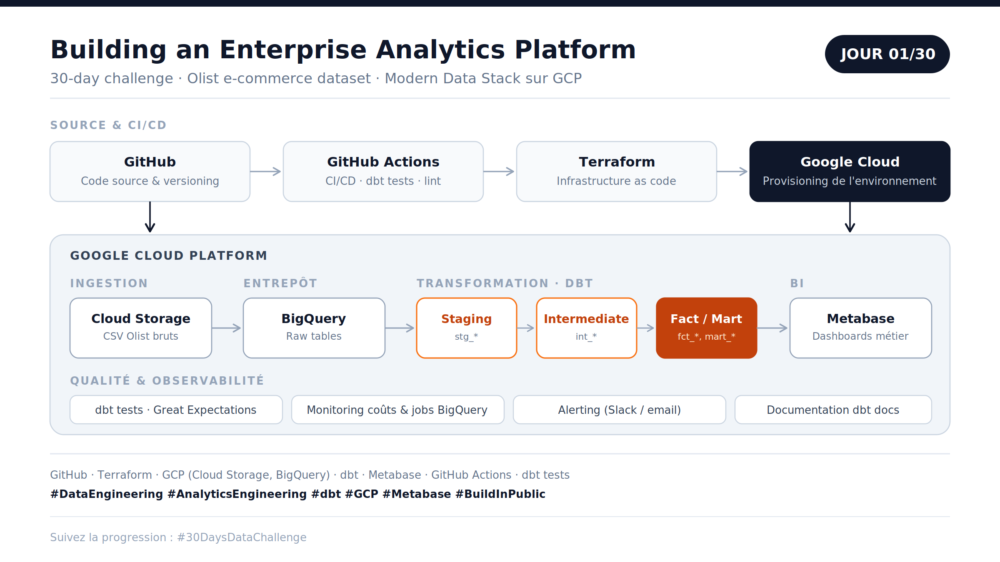

# Enterprise Analytics Engineering Challenge


**Build in public — 30 jours pour construire une plateforme Analytics de niveau entreprise**, de l'ingestion de données brutes jusqu'aux dashboards, avec les standards d'une stack de production : architecture, tests, documentation, CI/CD, monitoring.

---

## Sommaire

- [Contexte](#contexte)
- [Scénario](#scénario)
- [Architecture](#architecture)
- [Stack technique](#stack-technique)
- [Structure du projet](#structure-du-projet)
- [Modélisation des données](#modélisation-des-données)
- [Roadmap — 30 jours](#roadmap--30-jours)
- [Standards de qualité](#standards-de-qualité)
- [Suivre le challenge](#suivre-le-challenge)

---

## Contexte

Ce projet simule la construction d'une plateforme Analytics au sein d'une entreprise e-commerce, avec une exigence de production dès le premier jour : pas de tutoriel, pas de notebook isolé — un pipeline versionné, testé, documenté et déployé.

L'objectif n'est pas seulement de livrer un pipeline fonctionnel, mais de documenter une démarche d'ingénierie complète : décisions d'architecture, compromis techniques, incidents rencontrés et résolutions.

## Scénario

> Je pars d'un fichier CSV brut et je construis une plateforme data entreprise.

Le dataset utilisé est **Olist** (Brazilian E-Commerce Public Dataset), un jeu de données réel couvrant commandes, clients, vendeurs, paiements, avis et logistique — suffisamment riche pour représenter des domaines métier réalistes : ventes, marketing, stocks, finance.

## Architecture



Le pipeline suit un flux standard de production, de l'intégration continue jusqu'à la restitution :

| Étape | Rôle |
|---|---|
| **GitHub** | Versioning du code |
| **GitHub Actions** | CI/CD — tests dbt, lint, déploiement |
| **Terraform** | Provisioning de l'infrastructure GCP (infra as code) |
| **Cloud Storage** | Zone de dépôt des fichiers bruts |
| **BigQuery** | Entrepôt de données (raw + couches transformées) |
| **dbt** | Transformation — staging → intermediate → fact/mart |
| **Metabase** | Restitution et dashboards métier |
| **Monitoring & alerting** | Suivi des coûts, des jobs BigQuery, alertes Slack |

## Stack technique

- **Langages** : Python, SQL
- **Transformation** : dbt-core, dbt-bigquery
- **Entrepôt** : Google BigQuery
- **Stockage** : Google Cloud Storage
- **Infrastructure as code** : Terraform
- **CI/CD** : GitHub Actions
- **Qualité de données** : tests dbt (unique, not_null, relationships), Great Expectations
- **BI / restitution** : Metabase
- **Observabilité** : monitoring des coûts et des jobs BigQuery, alerting

## Structure du projet

```
enterprise-analytics-engineering-challenge/
├── .github/
│   └── workflows/          # Pipelines CI/CD (tests, déploiement)
├── terraform/               # Infrastructure as code (GCP)
├── dbt/
│   ├── models/
│   │   ├── staging/         # stg_* — nettoyage, typage, renommage
│   │   ├── intermediate/    # int_* — jointures, logique métier intermédiaire
│   │   └── marts/           # fct_*, mart_* — modèles finaux exposés
│   ├── seeds/
│   ├── snapshots/
│   └── dbt_project.yml
├── ingestion/                # Scripts de chargement CSV → Cloud Storage → BigQuery
├── docs/                     # Schémas, captures, notes d'architecture
├── README.md
└── .gitignore
```

## Modélisation des données

La transformation suit une architecture en couches, convention standard dbt :

1. **Staging** (`stg_`) — un modèle par source, renommage des colonnes, typage, aucune logique métier
2. **Intermediate** (`int_`) — jointures et logique de transformation intermédiaire, non exposée aux utilisateurs finaux
3. **Fact / Mart** (`fct_`, `dim_`, `mart_`) — modèles finaux orientés métier, consommés par Metabase


## Standards de qualité

- Tests dbt systématiques sur chaque modèle (unicité, valeurs non nulles, intégrité référentielle)
- Revue de code via pull request, même en solo (branche `main` protégée)
- Documentation générée automatiquement (`dbt docs`)
- Secrets et credentials gérés via GitHub Actions Secrets, jamais commités

## Suivre le challenge

Chaque étape est documentée publiquement avec le contexte, les problèmes rencontrés et les décisions techniques.

`#DataEngineering` `#AnalyticsEngineering` `#dbt` `#GCP` `#Metabase` `#BuildInPublic` `#30DaysDataChallenge`

---

## Licence

Ce projet est distribué sous licence MIT — voir le fichier [LICENSE](LICENSE).
