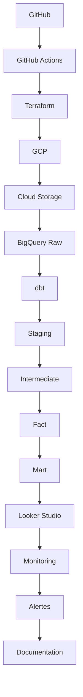

# Enterprise Analytics Engineering Challenge

Build in Public: Modern Data Stack on GCP + dbt

## Contexte

Pendant 30 jours, je construis une plateforme Analytics moderne comme si j etais recrute en tant qu Analytics Engineer dans une entreprise SaaS.
L objectif n est pas de suivre des tutoriels mais de reproduire les decisions et les contraintes d une vraie plateforme data en entreprise : architecture, bonnes pratiques, documentation, tests, cout et communication.

## Scenario

Je pars d un simple fichier CSV et je construis une plateforme data digne d une startup e commerce qui passe de 10 a 500 employes.
Le domaine couvre les ventes, les clients, les commandes, le marketing, les stocks et la finance.

## Architecture

## Planning

### Semaine 1, mise en place du projet

Jour 1, presentation du challenge.
Jour 2, architecture.
Jour 3, creation du repo.
Jour 4, Terraform.
Jour 5, infrastructure GCP.
Jour 6, premier pipeline.
Jour 7, bilan.

### Semaine 2, ingestion

CSV, API, Cloud Storage, BigQuery, partition, cluster, modeles incrementaux.

### Semaine 3, dbt

Models, sources, snapshots, seeds, tests, macros, packages, documentation, exposures, semantic layer si possible.

### Semaine 4, partie entreprise

CI/CD, GitHub Actions, environnements DEV et PROD, monitoring, optimisation des couts, performance BigQuery, observabilite, dashboard, documentation, deploiement final.

## Stack technique

Python, SQL, dbt, BigQuery, Terraform, GitHub Actions, Looker Studio.

## Livrable final

Un depot GitHub documente, une architecture cloud complete sur GCP, un projet dbt teste, une chaine CI/CD, des dashboards metier, une documentation technique claire, une serie de publications LinkedIn montrant la progression, et une histoire coherente a raconter en entretien.
