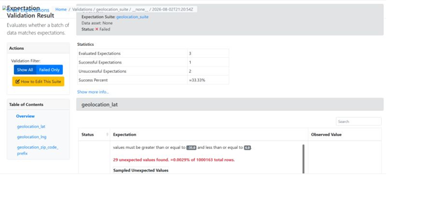
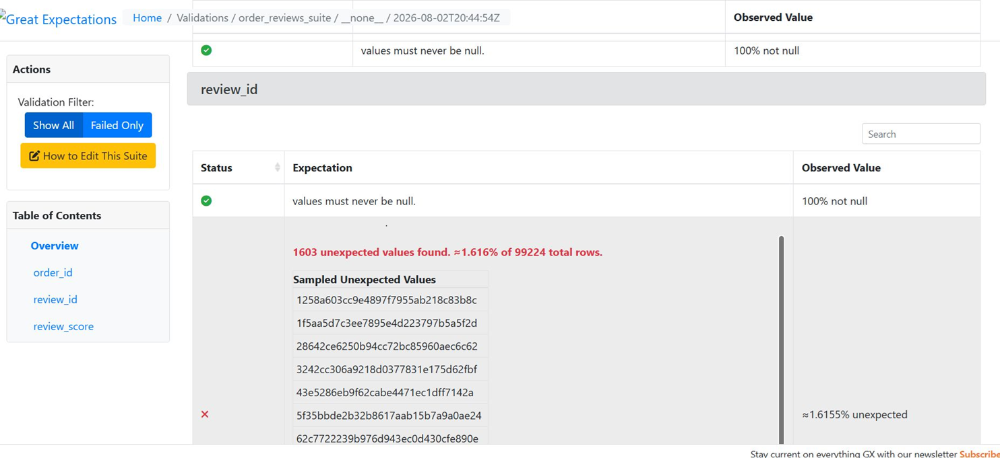
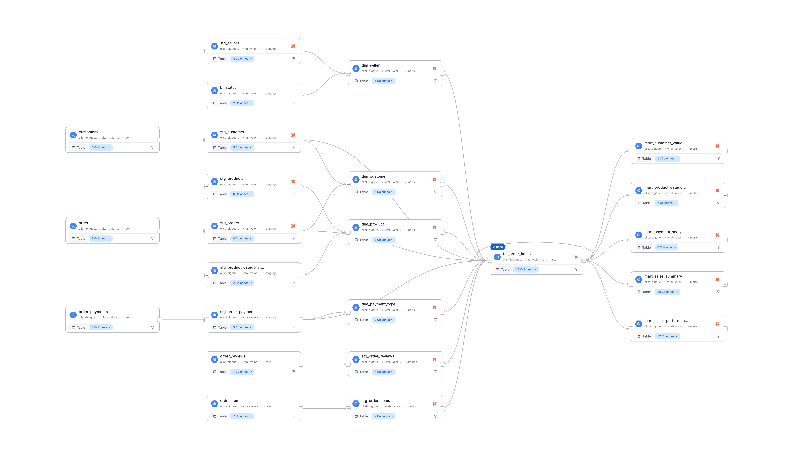
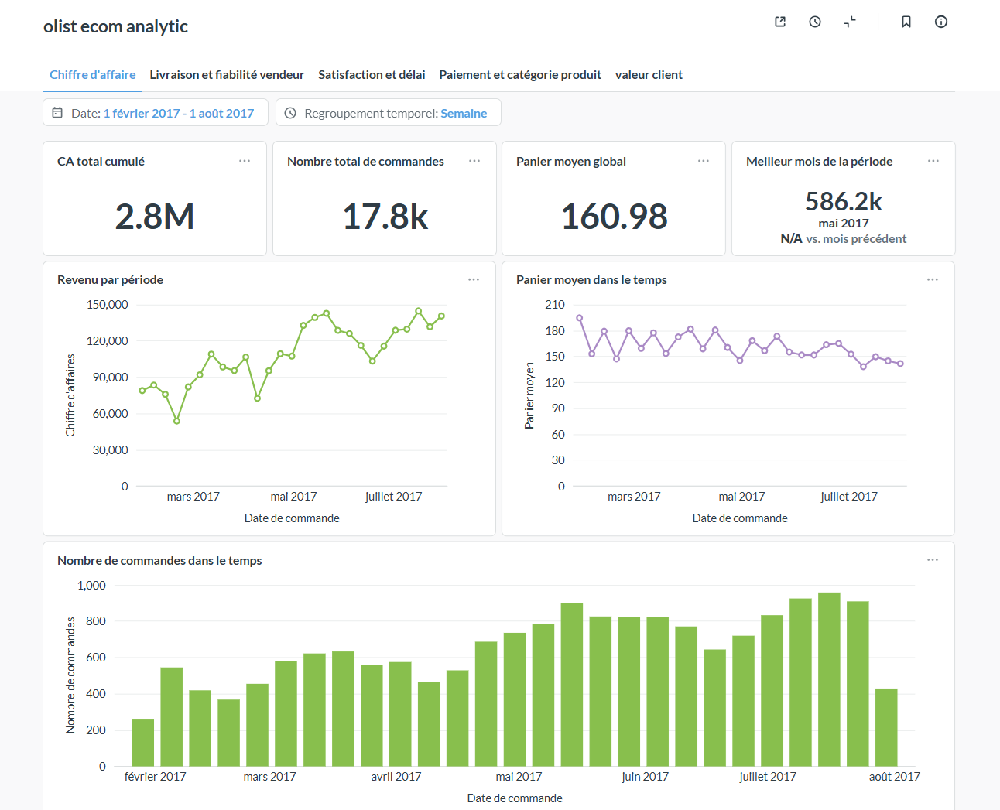
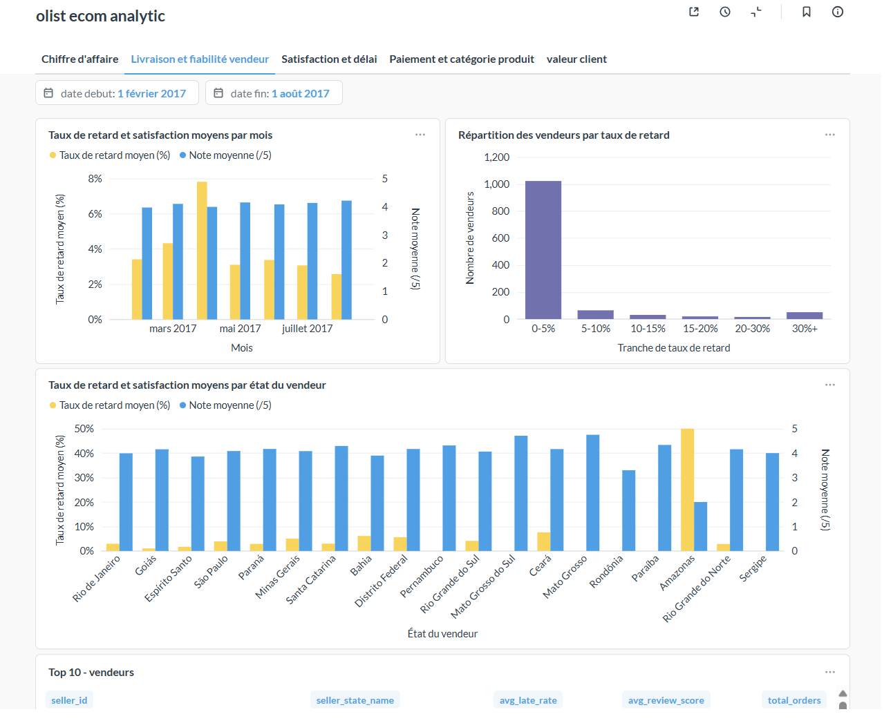
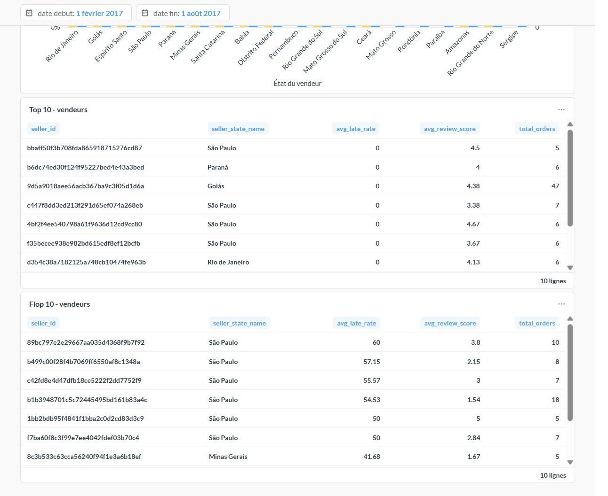
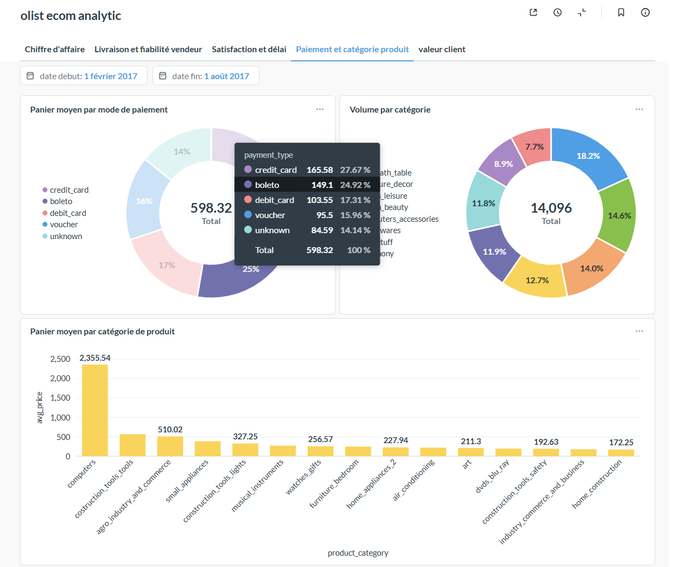

# Enterprise Analytics Engineering Challenge


**Build in public : 30 jours pour construire une plateforme Analytics de niveau entreprise**, de l'ingestion de données brutes jusqu'aux dashboards, avec les standards d'une stack de production : architecture, tests, documentation, CI/CD, monitoring, gouvernance des données.

---

## Sommaire

- [Contexte](#contexte)
- [Architecture](#architecture)
- [Stack technique](#stack-technique)
- [Structure du projet](#structure-du-projet)
- [Modélisation des données](#modélisation-des-données)
- [Qualité et gouvernance des données](#qualité-et-gouvernance-des-données)
- [CI/CD](#cicd)
- [Restitution](#restitution)
- [Coûts](#coûts)
- [Choix techniques notables](#choix-techniques-notables)
- [Bilan du challenge](#bilan-du-challenge)
- [Installation](#installation)

---

## Contexte

Ce projet simule la construction d'une plateforme Analytics au sein d'une entreprise e-commerce, avec une exigence de production dès le premier jour : pas de tutoriel, pas de notebook isolé, mais un pipeline versionné, testé, documenté et déployé.

Le dataset utilisé est le [Brazilian E-Commerce Public Dataset by Olist](https://www.kaggle.com/datasets/olistbr/brazilian-ecommerce), publié directement par Olist sur Kaggle : environ 100 000 commandes réelles, entre 2016 et 2018, sur un marketplace brésilien.

Chaque étape du projet a été documentée publiquement, décisions et incidents inclus, au fil de 30 jours.

## Architecture

```
CSV bruts → Cloud Storage → BigQuery (raw) → dbt (staging → marts) → Metabase
                                                    ↓
                                          OpenMetadata (catalogue)
```

| Étape | Rôle |
|---|---|
| **GitHub** | Versioning, gouvernance (branches protégées, PR obligatoires) |
| **GitHub Actions** | CI/CD : Slim CI, sauvegarde du manifest dbt, alertes Slack |
| **Terraform** | Infrastructure as code, organisée en modules |
| **Cloud Storage** | Zone de dépôt des fichiers bruts |
| **BigQuery** | Entrepôt de données (raw, staging, marts) |
| **dbt** | Transformation : staging, intermediate, marts |
| **Great Expectations** | Validation des données brutes avant ingestion |
| **Metabase** | Dashboards métier (Cloud Run + Cloud SQL) |
| **OpenMetadata** | Catalogue de données, glossaire métier, domaines |
| **Monitoring** | Suivi des coûts GCP, alerting Slack sur échec de pipeline |

## Stack technique

- **Langages** : Python, SQL
- **Transformation** : dbt-core, dbt-bigquery
- **Entrepôt** : Google BigQuery
- **Stockage** : Google Cloud Storage
- **Infrastructure as code** : Terraform (modules : bigquery, storage, iam, cloud_run, cloud_sql)
- **CI/CD** : GitHub Actions, Slim CI (`state:modified+`, `--defer`)
- **Qualité de données** : tests dbt (unique, not_null, relationships), dbt_expectations, Great Expectations
- **BI** : Metabase, déployé sur Cloud Run avec persistance Cloud SQL (PostgreSQL)
- **Catalogue de données** : OpenMetadata (Docker), synchronisé avec dbt et BigQuery
- **Observabilité** : suivi des coûts GCP via export de facturation, alerting Slack

## Structure du projet

```
enterprise-analytics-engineering-challenge/
├── .github/
│   └── workflows/            # Slim CI, sauvegarde du manifest dbt
├── terraform/
│   ├── environments/
│   │   └── prod/              # composition des modules
│   └── modules/
│       ├── bigquery/
│       ├── storage/
│       ├── iam/
│       ├── cloud_run/         # déploiement Metabase
│       └── cloud_sql/         # base de persistance Metabase
├── dbt/
│   ├── models/
│   │   ├── staging/            # stg_* : nettoyage, typage
│   │   ├── marts/              # dim_*, fct_*, mart_*
│   │   └── semantic/           # POC MetricFlow
│   ├── seeds/
│   ├── macros/                 # generate_schema_name_for_env
│   └── dbt_project.yml
├── ingestion/                  # scripts de chargement CSV → Cloud Storage → BigQuery
├── great_expectations_project/ # validation des données brutes
├── openmetadata/                # déploiement du catalogue de données
├── docs/
│   └── SETUP.md
└── README.md
```

## Modélisation des données

Architecture en couches, convention standard dbt :

1. **Staging** (`stg_`) : un modèle par source, renommage, typage, aucune logique métier
2. **Marts** : modèles finaux orientés métier
   - **Dimensions** : `dim_customer`, `dim_seller`, `dim_product`, `dim_payment_type`
   - **Fait** : `fct_order_items`, au grain de l'article commandé, partitionné et clusterisé
   - **Agrégats** : `mart_sales_summary`, `mart_seller_performance`, `mart_payment_analysis`, `mart_product_category_performance`, `mart_customer_value`, `mart_gcp_costs`

`dim_date` a été volontairement écartée : sur BigQuery, le calcul de date à la volée est quasi gratuit, et une dimension séparée aurait cassé le partition pruning sur le fait.

## Qualité et gouvernance des données

- **Tests dbt** sur les clés primaires et les valeurs attendues, sur l'ensemble des modèles
- **Great Expectations** valide 8 des 9 fichiers sources avant ingestion (le neuvième vit en seed dbt). Deux anomalies réelles ont été détectées et documentées : des doublons d'identifiant sur les avis clients (1,6 %), et 29 coordonnées de géolocalisation incompatibles avec le Brésil sur plus d'un million de lignes. Aucune des deux n'est bloquante
- **OpenMetadata** centralise la documentation (synchronisée automatiquement depuis dbt), un glossaire métier (valeur client, taux de retard, client récurrent, panier moyen) et trois domaines organisationnels (Ventes, Logistique, Satisfaction Client)

<p align="center">
  
  
</p>

Le lineage complet de `fct_order_items` (sources raw, modèles de staging, dimensions et marts consommateurs) est visible dans OpenMetadata :

<p align="center">
  
</p>

## CI/CD

Deux workflows GitHub Actions :

- **Sauvegarde du manifest** : à chaque merge sur `main`, génère et sauvegarde `manifest.json`/`catalog.json` sur Cloud Storage, et synchronise la documentation vers Metabase via `dbt-metabase`
- **Slim CI** : sur chaque pull request, ne reconstruit et ne teste que les modèles modifiés (`state:modified+`), avec `--defer` pour lire les modèles non modifiés depuis la production. Le run s'exécute dans un dataset isolé (`ci_pr`), jamais dans les données réelles

L'isolation des environnements (`prod`, `sandbox`, `ci_pr`) est gérée par une macro `generate_schema_name_for_env`, qui route le schéma cible selon la cible d'exécution, plutôt que par des environnements Terraform séparés. Un choix cohérent avec un projet à un seul projet GCP.

## Restitution

Cinq dashboards Metabase, un par question métier :

1. Chiffre d'affaires
2. Livraison et fiabilité vendeur
3. Satisfaction et délai
4. Paiement et catégorie produit
5. Valeur client

Chacun avec un filtre de période interactif. Metabase est déployé sur Cloud Run, avec une base PostgreSQL (Cloud SQL) pour la persistance de la configuration entre redémarrages.

<p align="center">
  
</p>
<p align="center">
  
</p>
<p align="center">
  
</p>
<p align="center">
  
</p>

## Coûts

Le suivi des coûts est intégré directement au pipeline dbt (`mart_gcp_costs`), à partir de l'export de facturation GCP. Coût cloud total du projet, à ce jour : **0,99 €**, résultat direct des choix d'architecture (partitionnement, clustering, région alignée sur les quotas gratuits).

## Choix techniques notables

- **MetricFlow (couche sémantique dbt)** a été testé en POC. Conclusion documentée dans un article dédié : peu de valeur ajoutée dans un contexte à un seul outil de BI, l'implémentation reste dans le repo à titre de référence
- **OpenMetadata** a été déployé en local (Docker), une stack multi-services non adaptée à Cloud Run. Un bug connu de MySQL 8.0.32 a nécessité une bascule vers la variante PostgreSQL du quickstart officiel
- **La structure Terraform en modules** s'inspire d'un article sur l'organisation Terraform pour Snowflake, adaptée à BigQuery et à un contexte mono-projet

## Bilan du challenge

- **37** commits
- **22** modèles dbt
- **37** tests
- **5** dashboards Metabase
- **9** sources de données validées
- **1** catalogue de données déployé
- **0,99 €** de coût cloud total
- **1** certification dbt obtenue en cours de route

## Installation

Voir [`docs/SETUP.md`](docs/SETUP.md) pour l'installation complète, de la création du projet GCP jusqu'au déploiement de chaque composant.

---

## Licence

Ce projet est distribué sous licence MIT. Voir le fichier [LICENSE](LICENSE).
